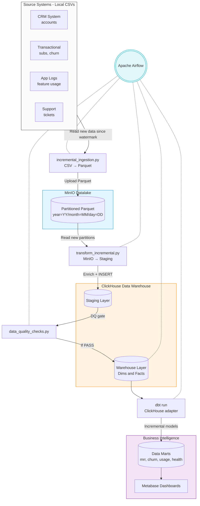

# SaaS Analytics Data Platform

A production-grade, fully incremental end-to-end data pipeline built for SaaS analytics (subscriptions, MRR, churn, and feature usage).

## 🏗️ Architecture Overview

The pipeline implements an **incremental ELT architecture**, meaning it only processes new data arriving each day, keeping overhead low and preventing expensive full-table scans.



### Key Technologies
| Component | Technology | Purpose |
|---|---|---|
| Object Storage | MinIO (S3 compatible) | Immutable data lake for raw Parquet files |
| Data Format | Apache Parquet (Snappy) | Columnar, compressed, partitioned by date |
| Data Engineering | Python + Pandas | Lightweight incremental transformations |
| Warehouse | ClickHouse | Analytical columnar DB (ReplacingMergeTree) |
| Data Modeling | dbt (ClickHouse adapter) | Incremental data mart layer |
| Orchestration | Apache Airflow (standalone) | `@daily` incremental load DAG |
| BI / Viz | Metabase | Self-service dashboards |

---

## 🚀 How to Run the Project

### 1. Start the Infrastructure
Bring up all services (MinIO, ClickHouse, Airflow, dbt, Metabase, and the Python ETL container):
```bash
docker-compose up -d
```

### 2. Initialize the ClickHouse Warehouse
Before running the pipeline, create the databases and tables (staging, dims, facts, marts):
```bash
cat airflow/sql/ddl_warehouse.sql | docker exec -i clickhouse-saas clickhouse-client --multiquery
```

### 3. Run the Pipeline (Manual Execution)
Run the steps sequentially to simulate a daily batch run:

```bash
# Step 1: Ingest raw CSVs → MinIO (partitioned Parquet)
docker exec python-saas bash -c "cd /app && python incremental_ingestion.py"

# Step 2: Transform MinIO → ClickHouse staging
docker exec python-saas bash -c "cd /app && python transform_incremental.py"

# Step 3: Data quality checks (gates the pipeline)
docker exec python-saas bash -c "cd /app && python data_quality_checks.py"

# Step 4: Load staging → warehouse (dims + facts)
docker exec python-saas bash -c "cd /app && python load_warehouse_incremental.py"

# Step 5: Build data marts via dbt
docker exec dbt-saas bash -c "dbt run"
```

**Convenience wrapper** (runs steps 1-2 together — dev/local only):
```bash
docker exec python-saas bash -c "cd /app && python ingest_and_stage.py"
```

### 4. Verify the Results
1. **MinIO** (Raw Datalake): Go to [http://localhost:9001](http://localhost:9001) (admin / password123). Check the `saas-raw` bucket for Parquet partitions.
2. **ClickHouse** (Warehouse): Access the client to query your dims and facts:
   ```bash
   docker exec -it clickhouse-saas clickhouse-client
   # Then run: SELECT count() FROM warehouse.fact_subscriptions FINAL;
   ```
3. **Airflow** (Orchestration): Go to [http://localhost:8080](http://localhost:8080) to view the `saas_incremental_pipeline` DAG.
4. **Metabase** (BI): Go to [http://localhost:3000](http://localhost:3000) to build dashboards on top of the `mart` database.

---

## 📊 Pipeline Orchestration (DAG)

The Airflow DAG `saas_incremental_pipeline` runs `@daily` and processes data incrementally:

```
ingest_raw_to_minio → transform_to_staging → data_quality_checks
    → load_warehouse → dbt_run_marts → pipeline_complete
```

| Task | Script | Description |
|---|---|---|
| `ingest_raw_to_minio` | `incremental_ingestion.py` | CSV → MinIO (Parquet, partitioned by date) |
| `transform_to_staging` | `transform_incremental.py` | MinIO → ClickHouse staging (business logic) |
| `data_quality_checks` | `data_quality_checks.py` | 7 automated DQ checks on staging data |
| `load_warehouse` | `load_warehouse_incremental.py` | staging → warehouse dims + facts (UPSERT) |
| `dbt_run_marts` | `dbt run --select mart` | Build incremental data mart aggregations |

---

## 📈 Data Model (Star Schema)

The warehouse follows a classic Kimball Star Schema natively optimized for ClickHouse's `ReplacingMergeTree` engine, which handles idempotent UPSERTs automatically via a version `_updated_at` column.

**Dimensions**:
- `dim_accounts` (Company info, signup date, industry)
- `dim_plans` (Plan tiers: Free, Basic, Pro, Enterprise)
- `dim_date` (Master date table: 2024-01-01 → 2026-12-31)

**Facts**:
- `fact_subscriptions` (MRR, ARR, churn_flag, reactivation_flag, subscription_sequence)
- `fact_churn_events` (Cancellation reason codes, refund amounts)
- `fact_feature_usage` (Daily log of feature usage duration/count)
- `fact_support_tickets` (Helpdesk metrics and satisfaction scores)

**Data Marts (built by dbt)**:
- `mart_mrr_monthly` (Revenue tracking by tier)
- `mart_churn_summary` (Churn rate % and recovery metrics)
- `mart_feature_usage_summary` (Feature popularity and error tracking)
- `mart_customer_health_score` (0-100 composite score with churn risk labels)

For detailed modeling schemas, refer to `docs/ERD.md`. For layer-by-layer lineage, refer to `docs/DATA_LINEAGE.md`.

---

## 🔄 Incremental Processing Strategy

| Layer | Mechanism | Watermark Prefix |
|---|---|---|
| Ingestion (CSV → MinIO) | Date filter on CSV rows | `ingestion_*` |
| Transform (MinIO → Staging) | Read new MinIO partitions | `transform_*` |
| Warehouse (Staging → DWH) | Filtered INSERT + ReplacingMergeTree | `warehouse_*` |
| Marts (dbt) | `delete+insert` incremental strategy | Built-in dbt |

**Watermark state** is stored in `data/watermarks/watermarks.json` and persists across container restarts.

**Re-processing / backfill**:
```bash
# Reset a table and re-process
python -c "from watermark_tracker import reset_watermark; reset_watermark('ingestion_subscriptions')"
python incremental_ingestion.py 2024-06-01
python transform_incremental.py 2024-06-01
python load_warehouse_incremental.py 2024-06-01
```